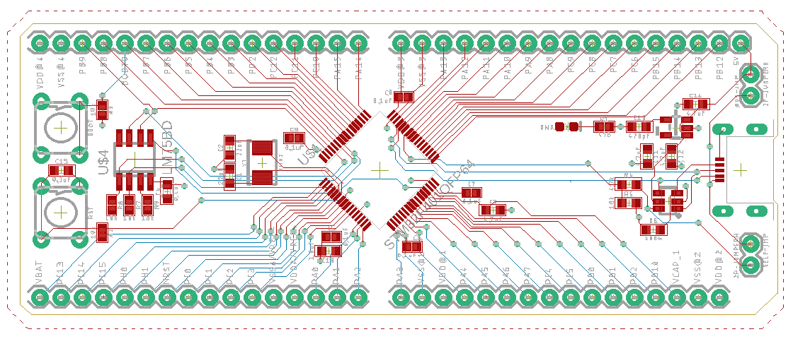

# STM32F401-Breakout

This is a breakout board for the STM32F401 using the [STM32F4Stamp](https://eleccelerator.com/stm32f4stamp-breakout-board/) (designed by Frank Zhao) as a reference.

It is untested, as this was only a personal project for gaining experience with PCB design.

